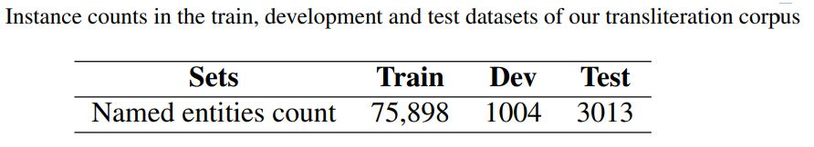
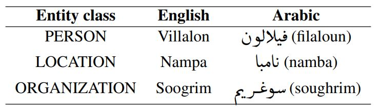
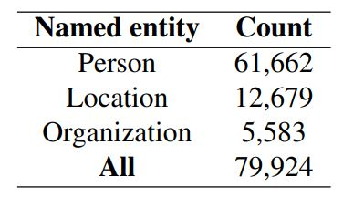

# Arabic-English-Transliteration-Dataset

## Description

This is a dataset containing 79,924 named entites in Arabic and their transliteration in English. The dataset was published as part of the paper 
[Arabic Machine Transliteration using an Attention-based Encoder-decoder Model](https://www.sciencedirect.com/science/article/pii/S1877050917321774)

The dataset is split into train, test, and development sets:

<div align="center">

</div>

## Examples

Examples of the instances present in the dataset are provided in the below Table: 

<div align="center">
    
</div>


## Statistics

The statistics the dataset are provided in the below Table: 

<div align="center">

</div>


## Citations
If you want to use the dataset please cite the following arXiv paper:


```
@article{HADJAMEUR2017287,
title = {Arabic Machine Transliteration using an Attention-based Encoder-decoder Model},
journal = {Procedia Computer Science},
volume = {117},
pages = {287-297},
year = {2017},
note = {Arabic Computational Linguistics},
issn = {1877-0509},
doi = {https://doi.org/10.1016/j.procs.2017.10.120},
url = {https://www.sciencedirect.com/science/article/pii/S1877050917321774},
author = {Mohamed Seghir {Hadj Ameur} and Farid Meziane and Ahmed Guessoum},
keywords = {Natural Language Processing, Arabic Language, Arabic Transliteration, Deep Learning, Sequence-to-sequence Models, Encoder-decoder Architecture, Recurrent Neural Networks},
abstract = {Transliteration is the process of converting words from a given source language alphabet to a target language alphabet, in a way that best preserves the phonetic and orthographic aspects of the transliterated words. Even though an important effort has been made towards improving this process for many languages such as English, French and Chinese, little research work has been accomplished with regard to the Arabic language. In this work, an attention-based encoder-decoder system is proposed for the task of Machine Transliteration between the Arabic and English languages. Our experiments proved the efficiency of our proposal approach in comparison to some previous research developed in this area.}
}
```

## Contacts:
For all questions please contact ``mohamedhadjameur@gmail.com`` 

